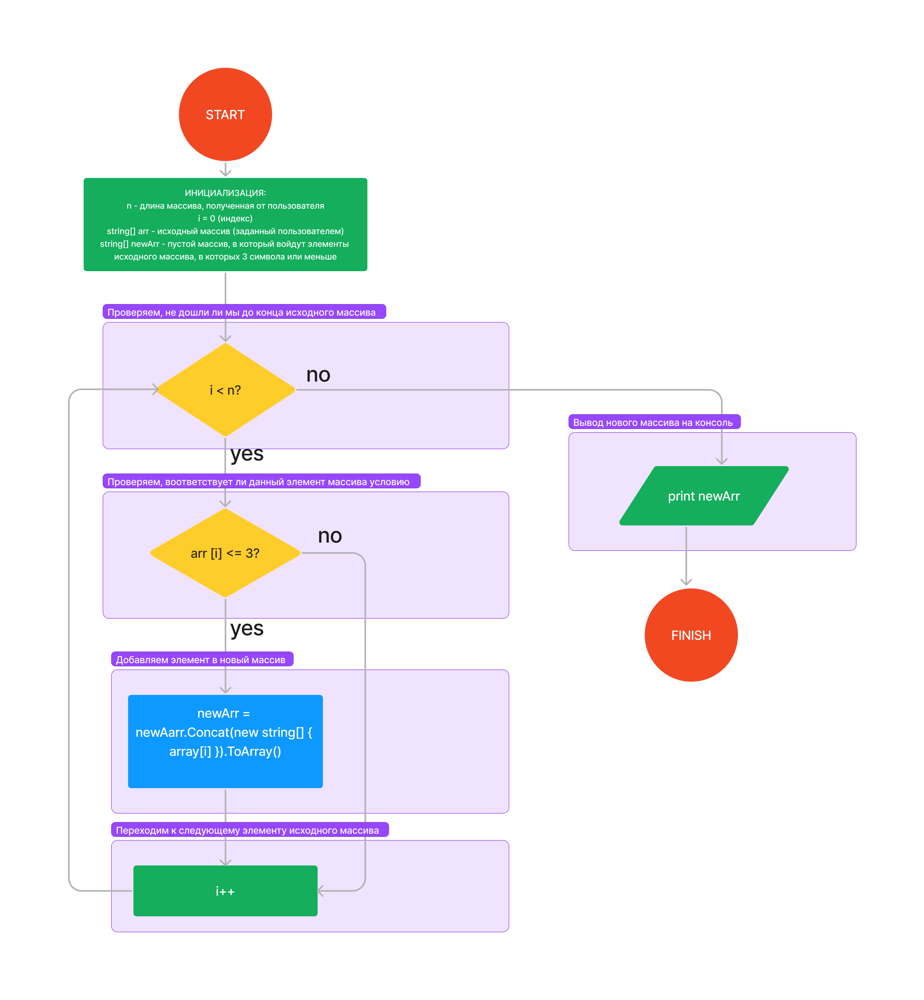

**КОНТРОЛЬНАЯ РАБОТА**

*Текст задачи:*  

Написать программу, которая из имеющегося массива строк формирует массив из строк, длина которых меньше либо равно 3 символам. Первоначальный массив можно ввести с клавиатуры, либо задать на старте выполнения алгоритма. При решении не рекомендуется пользоваться коллекциями, лучше обойтись исключительно массивами.

*Описание решения:*

1. Метод **InitArray** - используется для того, чтобы задать линейный массив строк. Пользователь вводит с клавиатуры размерность массива и элементы массива.
2. Метод **ResultArray** - используется для того, чтобы создать новый массив, элементами которого являются элементы старого массива, которые соответствуют условию "количество символов меньше или равно 3". За размерность массива изначально принимается 0, после чего с помощью метода  *.Concat* массив заполняется подходящими элементами.
3. **Блок-схема** 

